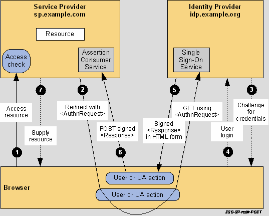

# SAML-SP 

Boilerplate for SAML Service Provider implementation.

## SP-Initiated SSO: Redirect/POST Bindings

See http://docs.oasis-open.org/security/saml/Post2.0/sstc-saml-tech-overview-2.0.html

## Run locally on Docker

- `git clone https://github.com/giosil/saml-sp.git` 
- `mvn clean install` - this will produce `saml-sp.war` in `target` directory
- `docker build -t saml-sp .` - this will create a Docker image named saml-sp
- `docker run --rm -it -p 8080:8080 saml-sp` - To run image named saml-sp

## Contributors

* [Giorgio Silvestris](https://github.com/giosil)
